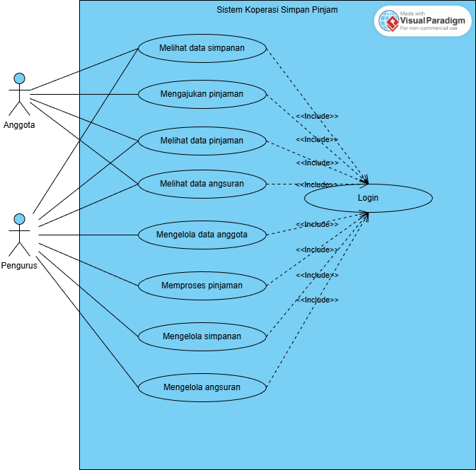
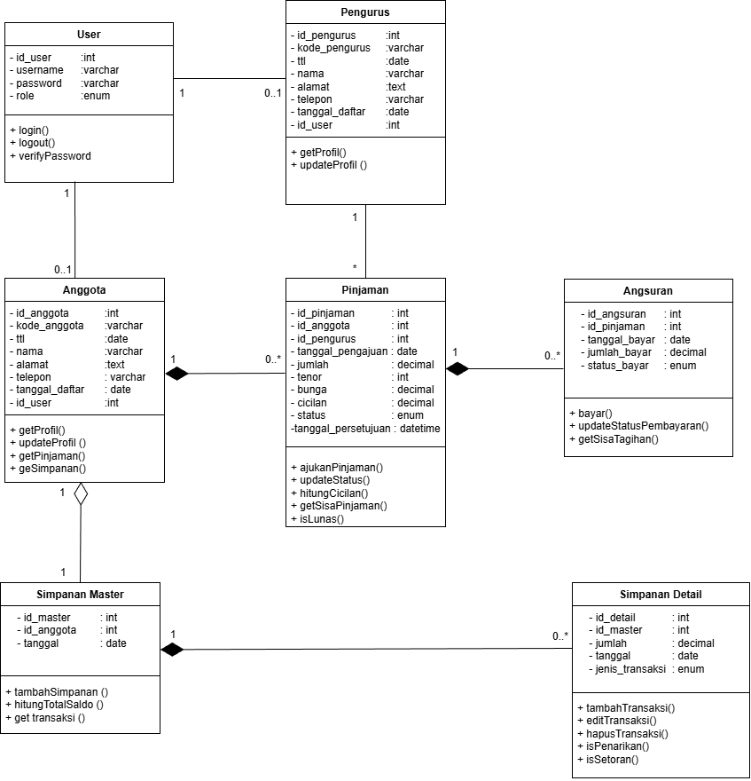
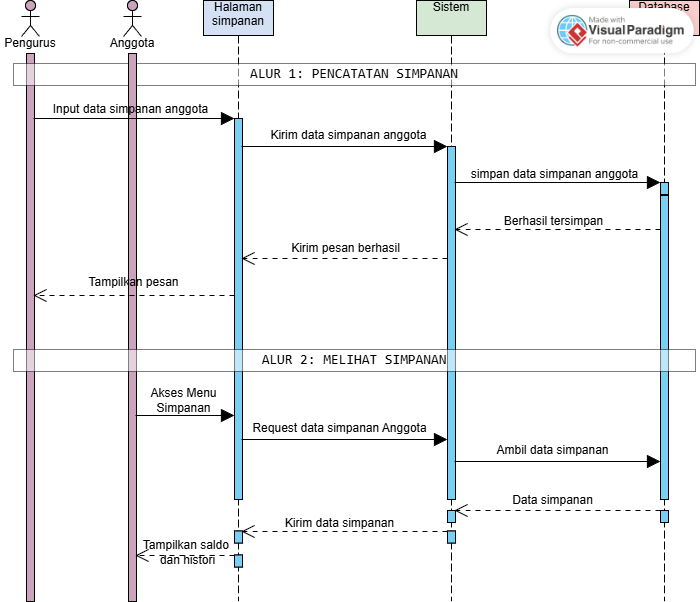
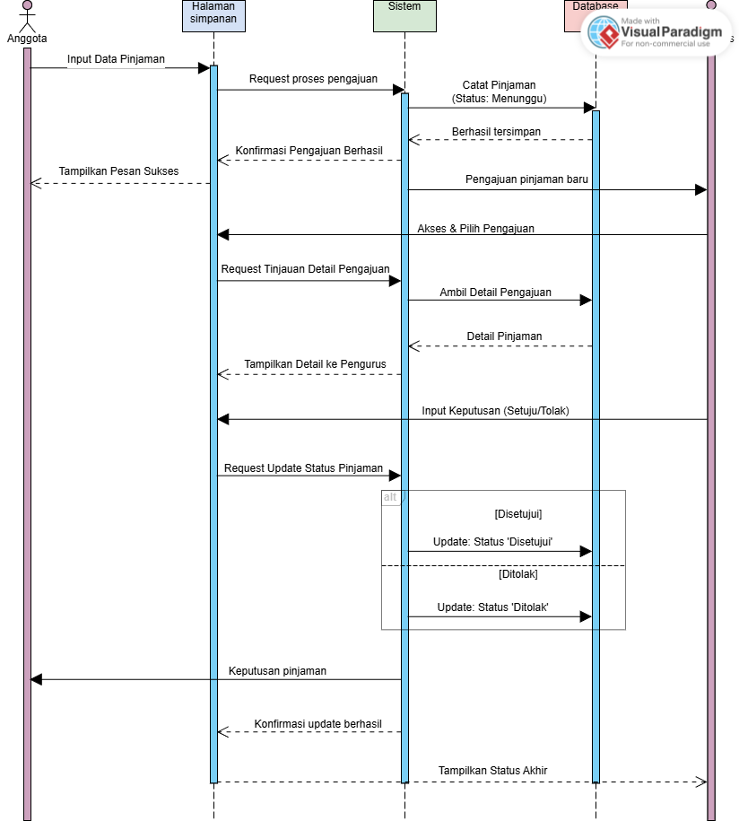
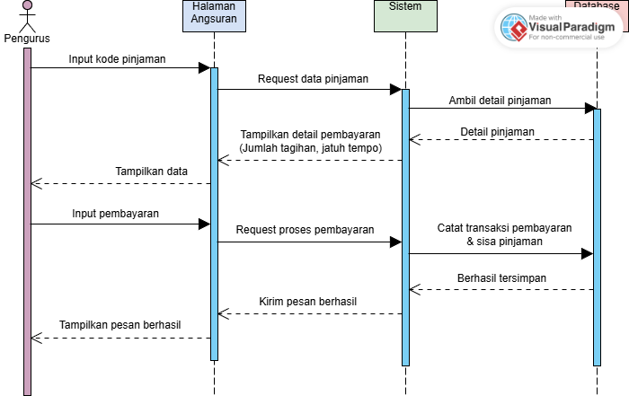
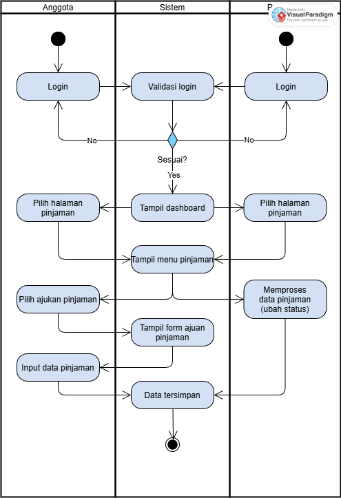
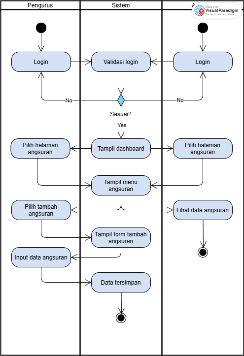
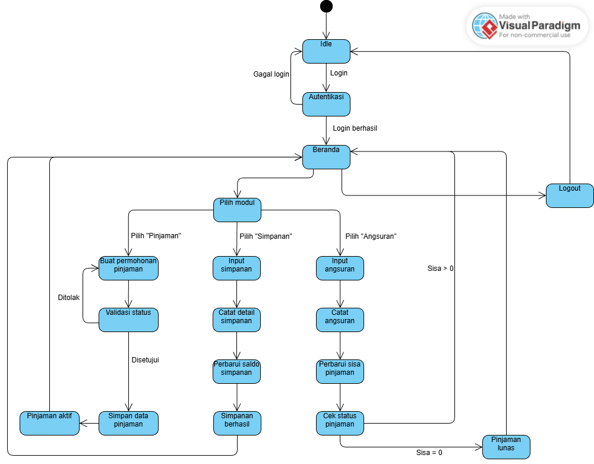

# Rancang Bangun Sistem Koperasi Simpan Pinjam

## 1. Latar Belakang
Sebuah koperasi simpan pinjam ingin mengembangkan sistem manajemen koperasi digital yang dapat mengelola kegiatan simpanan, pinjaman, dan angsuran anggota secara terintegrasi. Sistem ini bertujuan untuk meningkatkan efisiensi pengelolaan data, mempercepat proses transaksi, serta meminimalisir kesalahan pencatatan yang sering terjadi pada sistem manual.
Sistem harus mampu mengelola data anggota, mencatat transaksi simpanan dan pinjaman, serta memantau status pembayaran angsuran secara otomatis. Selain itu, sistem perlu mendukung berbagai peran pengguna seperti pengurus dan anggota, dengan hak akses yang disesuaikan berdasarkan tanggung jawab masing-masing.
Dengan adanya sistem koperasi simpan pinjam ini, diharapkan proses administrasi koperasi menjadi lebih transparan, akurat, dan efisien, sekaligus memudahkan anggota dalam memperoleh informasi terkait simpanan, pinjaman, serta transaksi mereka.

## 2. Aktor & Use Case Diagram
### Aktor Utama
- Anggota
- Pengurus

### Use Case



## 3. Kelas-Kelas & Class Diagram
### Kelas Utama
- User
- Anggota
- Pengurus
- Pinjaman
- Angsuran
- Simpanan Master
- Simpanan Detail

### Class Diagram


## 4. Prinsip SOLID & Design Patterns
### Prinsip SOLID yang Dipilih
- Single Responsibility Principle (SRP)
  Setiap class hanya punya satu tanggung jawab. Contoh: DatabaseManager hanya mengelola koneksi, UserFactory hanya membuat user, PinjamanBuilder hanya membangun objek pinjaman.
- Open/Closed Principle (OCP)
  Sistem dapat diperluas tanpa mengubah kode yang sudah ada. Misal: menambah role baru (UserAdmin) cukup tambahkan class dan Factory baru, tanpa mengubah UserFactory.
- Dependency Inversion Principle (DIP)
  AnggotaService tidak membuat dependency sendiri, tetapi menerima DatabaseManager dari luar, sehingga dependency bergantung pada abstraksi.

### Contoh Creational Design Patterns
- Singleton
  
 ```php
  
CLASS DatabaseManager:
    PRIVATE STATIC $instance = NULL // Penyimpan instance tunggal
    
    PRIVATE METHOD __construct()
        // Kunci: Konstruktor harus private
        // Inisialisasi koneksi DB (hanya sekali)

    PUBLIC STATIC METHOD getInstance()
        IF $instance IS NULL THEN
            $instance = NEW DatabaseManager() // Buat hanya jika belum ada
        END IF
        RETURN $instance // Selalu kembalikan instance yang sama

// PENGGUNAAN:
$db1 = DatabaseManager::getInstance()
$db2 = DatabaseManager::getInstance() 
// $db1 selalu sama dengan $db2

```

- Factory Method:

```php

// Produk Dasar: Antarmuka yang akan dibuat oleh Pabrik
INTERFACE UserBase {
    PUBLIC METHOD getRole(): string
}

// Produk Konkret 1
CLASS UserAnggota IMPLEMENTS UserBase {
    PUBLIC METHOD __construct(array $data) {
        // Logika inisialisasi Anggota
        $this->role = 'Anggota'
    }
    PUBLIC METHOD getRole(): string { RETURN $this->role }
}

// Produk Konkret 2
CLASS UserPengurus IMPLEMENTS UserBase {
    PUBLIC METHOD __construct(array $data) {
        // Logika inisialisasi Pengurus
        $this->role = 'Pengurus'
    }
    PUBLIC METHOD getRole(): string { RETURN $this->role }
}

// Creator Abstrak (Pabrik Dasar)
ABSTRACT CLASS UserFactory {
    
    // Factory Method: Harus diimplementasikan (di-override) oleh subclass
    ABSTRACT PUBLIC METHOD createUser(array $data) : UserBase
    
    // Metode Klien: Logika umum yang menggunakan produk
    PUBLIC METHOD loginUser(array $data) {
        $user = $this->createUser($data) // PANGGILAN KUNCI: Minta produk dari subclass
        
        ECHO "User dengan peran " . $user->getRole() . " berhasil diverifikasi."
        RETURN $user
    }
}

// Creator Konkret 1: Pabrik khusus Anggota
CLASS AnggotaFactory EXTENDS UserFactory {
    PUBLIC METHOD createUser(array $data) : UserBase {
        // Pabrik ini menentukan objek mana yang dibuat
        RETURN NEW UserAnggota($data) 
    }
}

// Creator Konkret 2: Pabrik khusus Pengurus
CLASS PengurusFactory EXTENDS UserFactory {
    PUBLIC METHOD createUser(array $data) : UserBase {
        // Pabrik ini menentukan objek mana yang dibuat
        RETURN NEW UserPengurus($data)
    }
}

```

- Builder:

```php

CLASS Pinjaman:
    // Properti: $jumlah, $tenor, $cicilan

CLASS PinjamanBuilder:
    PRIVATE $pinjaman // Menyimpan objek yang sedang dibuat

    METHOD reset() 
        $this->pinjaman = NEW Pinjaman() // Buat objek Pinjaman baru

    METHOD setJumlah(jumlah)
        $this->pinjaman->jumlah = jumlah
        RETURN $this // Mengizinkan chaining

    METHOD hitungCicilan() // Langkah kompleks
        // Logika: hitung cicilan berdasarkan jumlah dan tenor
        $this->pinjaman->cicilan = (jumlah + bunga) / tenor
        RETURN $this

    METHOD getResult()
        RETURN $this->pinjaman // Kembalikan objek yang sudah selesai

// PENGGUNAAN:
$builder = NEW PinjamanBuilder()

$pinjamanBaru = $builder
    ->setJumlah(5000000)
    ->hitungCicilan() // Langkah 2 setelah setJumlah
    ->getResult()

```

## 5. Sequence & Activity Diagram
### Sequence Diagram
- #### Simpanan


- #### Pinjaman


- #### Angsuran


### Activity Diagram
- #### Simpanan


- #### Pinjaman


- #### Angsuran


## 6. State Machine & Evaluasi Desain
### State Machine


### Evaluasi Desain
- Maintainable: Baik
  - Pemodelan Domain yang Jelas (Class Diagram): Domain telah dipisah dengan baik menjadi entitas yang kohesif: Anggota, Pinjaman, Angsuran, Simpanan Master, dan Simpanan Detail. Setiap kelas memiliki tanggung jawab yang jelas.
  - Open/Closed Principle (OCP): Penggunaan Factory Method memungkinkan penambahan jenis User baru (Admin, Supervisor) tanpa mengubah kode inti (UserFactory atau logika login).
  - Penggunaan State Machine Diagram untuk alur Pinjaman menunjukkan manajemen lifecycle yang terstruktur.
  - Separation of Concerns pada Transaksi: Pemisahan antara Simpanan Master (saldo total, data utama) dan Simpanan Detail (setiap transaksi) adalah praktik yang sangat baik. Ini memastikan penambahan atau pengubahan satu detail transaksi tidak memengaruhi integritas data Master secara langsung, mempermudah pelacakan dan auditing.

- Reusable: Baik
  -  Pemisahan Simpanan: Pemisahan antara Simpanan Master dan Simpanan Detail memungkinkan modul lain hanya perlu berinteraksi dengan Simpanan Master (untuk saldo) atau Simpanan Detail (untuk laporan audit) tanpa memuat seluruh data.

- Extendable: Baik
  -  Normalisasi Data yang Baik: Struktur hubungan seperti 1-ke-Banyak (1:0..*) antara Anggota dan Pinjaman, dan antara Pinjaman dan Angsuran menunjukkan normalisasi data yang baik. Ini mengurangi redundansi data dan efisien untuk pertumbuhan data.

### Saran Improvement Fitur Baru
Membuat fitur untuk  meningkatkan transparansi dan komunikasi antara Koperasi dan Anggota melalui Pemberitahuan Otomatis
Sistem secara otomatis mengirimkan notifikasi (email/SMS/in-app) mengenai status pengajuan pinjaman, jatuh tempo angsuran, atau laporan simpanan tahunan.
Adapun manfaatnya:
- Bagi Anggota:
  -  Meningkatkan Transparansi: Anggota mendapat informasi status pinjaman dan transaksi simpanan secara real-time.
  -  Peringatan jatuh tempo angsuran mengurangi risiko keterlambatan.
  -  Meningkatkan Kenyamanan: Akses informasi cepat tanpa perlu kontak manual ke Pengurus.
- Bagi Koperasi:
  -  Menurunkan Risiko: Pengingat rutin mengurangi jumlah kredit macet/terlambat bayar.
  -  Meningkatkan Efisiensi: Mengotomatisasi tugas pengiriman pesan yang sebelumnya dilakukan manual oleh Pengurus.
  -  Membangun Citra: Koperasi terlihat modern, profesional, dan responsif.


## Biodata
-  #### Nama: Warni
-  #### NIM: 220220025
-  #### Semester: VII (Tujuh)
-  #### Prodi: Sistem Informasi
-  #### Mata Kuliah: Rekayasa Perangkat Lunak
